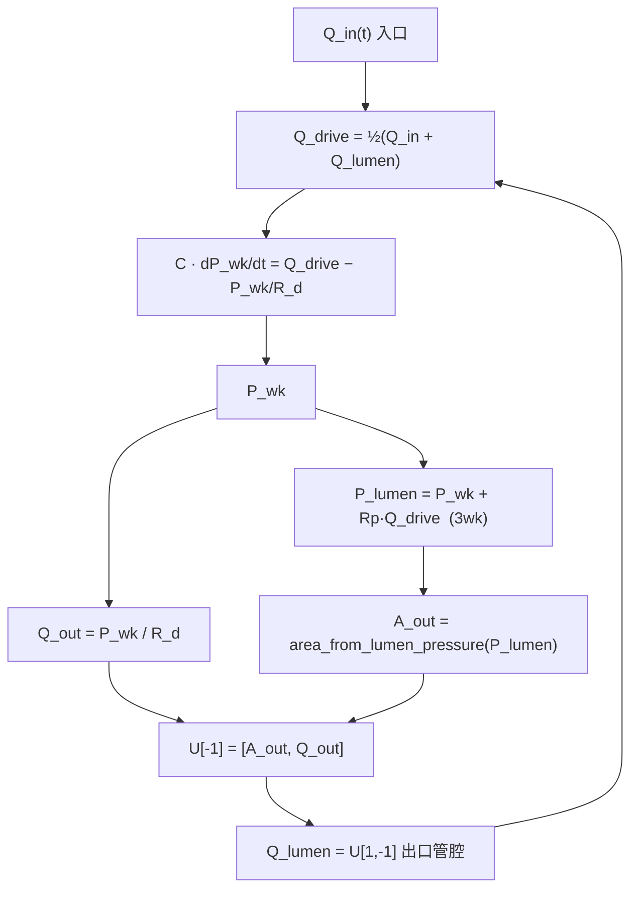
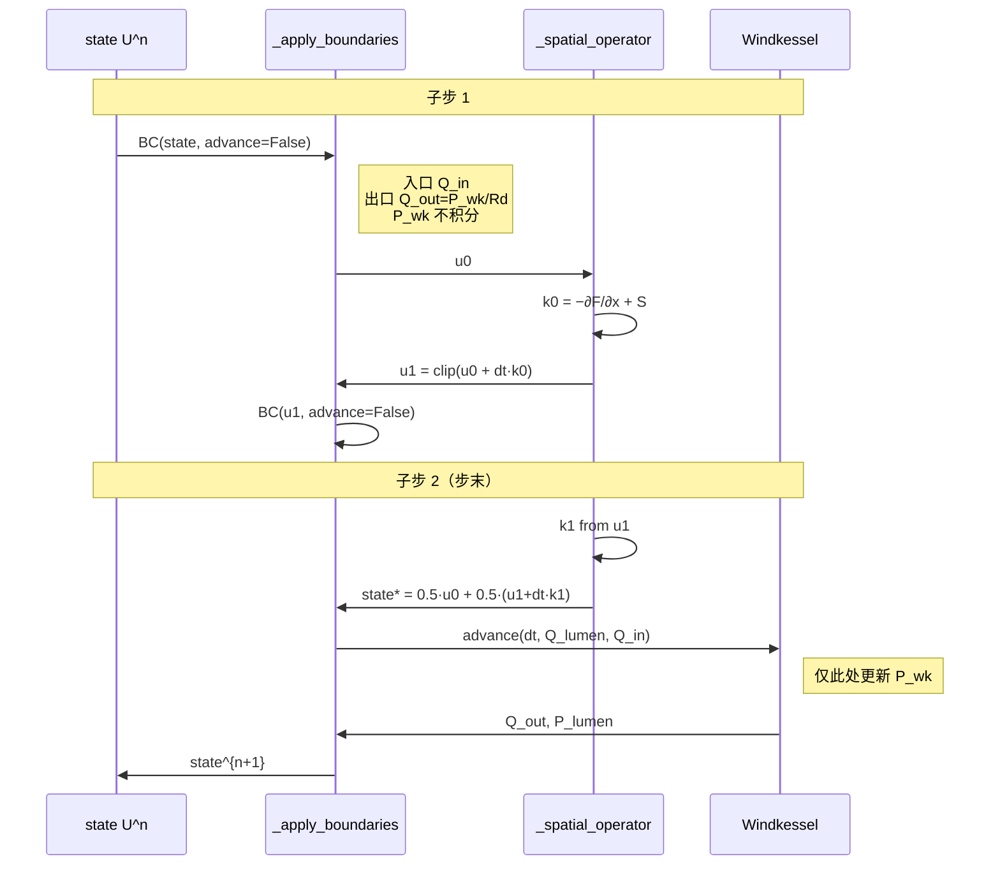
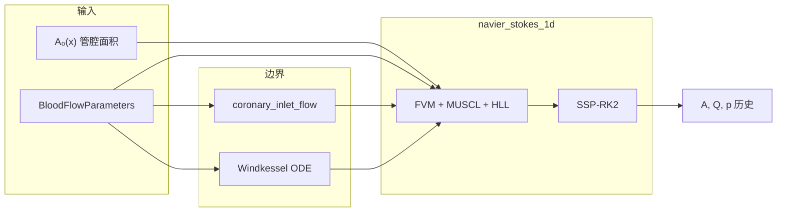

# 一维冠脉血流求解器说明（`navier_stokes_1d.py`）

本文档说明 `navier_stokes_1d.py` 的物理模型、数值方法、输入输出、API 用法及与 `coronary_inlet.py`、`coronary_outlet.py` 的衔接方式。

---

## 目录

1. [概述](#1-概述)
2. [环境与依赖](#2-环境与依赖)
3. [物理模型与单位](#3-物理模型与单位)
4. [数值方法](#4-数值方法)
5. [边界条件](#5-边界条件)
6. [快速开始](#6-快速开始)
7. [输入数据：管腔面积剖面](#7-输入数据管腔面积剖面)
8. [参数类 `BloodFlowParameters`](#8-参数类-bloodflowparameters)
9. [求解器 `NavierStokes1D`](#9-求解器-navierstokes1d)
10. [后处理与 FFR](#10-后处理与-ffr)
11. [与离线 Windkessel 对比](#11-与离线-windkessel-对比)
12. [参数调优建议](#12-参数调优建议)
13. [限制与扩展方向](#13-限制与扩展方向)
14. [常见问题](#14-常见问题)
15. [文件关系速查](#15-文件关系速查)

---

## 1. 概述

`navier_stokes_1d.py` 实现**单支冠状动脉**在轴向 \(x \in [0, L]\) 上的一维可变形管血流传播。以截面积 \(A(x,t)\) 与体积流量 \(Q(x,t)\) 为求解变量，管壁压力由弹性 tube law 闭合，入口/出口边界分别由专用模块提供。

| 项目 | 说明 |
|------|------|
| 控制方程 | 1D 守恒型 Navier-Stokes（含 Poiseuille 摩擦源项） |
| 管壁 | \(p = P_{\mathrm{ref}} + \beta(\sqrt{A}-\sqrt{A_0})\) |
| 空间离散 | 有限体积 + MUSCL + minmod TVD + HLL |
| 时间离散 | SSP-RK2 |
| 入口 | `coronary_inlet.coronary_inlet_flow` |
| 出口 | 与 `coronary_outlet` 一致的 Windkessel ODE（在线耦合） |
| 主输入 | 沿程参考管腔面积 \(A_0(x)\) + `BloodFlowParameters` |

> 本模块**不依赖** `demo/navier_stokes.py`；`demo/` 目录下为早期原型，接口与边界实现不同，请勿混用。

---

## 2. 环境与依赖

| 依赖 | 用途 |
|------|------|
| Python 3.10+ | 类型注解、`float \| None` 等语法 |
| `numpy` | 数组与数值计算 |
| `matplotlib` | `plot_results()` 绘图（可选） |
| `coronary_inlet.py` | 入口脉动流量 |
| `coronary_outlet.py` | Windkessel 参数约定与离线参考压力 |
| `coronary_constants.py` | 共享公开全局常量（`P_INLET_REF_MMHG`、`MMHG_TO_DYNE_PER_CM2` 等） |

安装示例：

```bash
pip install numpy matplotlib
```

无图形界面时：

```bash
# Windows PowerShell
$env:MPLBACKEND = "Agg"
python navier_stokes_1d.py
```

---

## 3. 物理模型与单位

### 3.1 守恒方程

\[
\frac{\partial U}{\partial t} + \frac{\partial F}{\partial x} = S,
\quad
U = \begin{bmatrix} A \\ Q \end{bmatrix}
\]

\[
F = \begin{bmatrix} Q \\ \dfrac{\alpha Q^2}{A} + \dfrac{p(A)\,A}{\rho} \end{bmatrix},
\quad
S = \begin{bmatrix} 0 \\ -\dfrac{8\pi\mu Q}{A} \end{bmatrix}
\]

| 符号 | 含义 |
|------|------|
| \(A\) | 血管截面积 |
| \(Q\) | 体积流量（沿 \(x\) 正向为出口方向） |
| \(\rho\) | 血液密度 |
| \(\alpha\) | 动量修正系数（层流常取 1.1） |
| \(\mu\) | 运动粘度 |
| 摩擦项 | Poiseuille 型 \(-8\pi\mu Q/A\) |

通量中的 \(p(A)\) 在计算动量项时由 **mmHg 换算为 cgs（dyne/cm²）**，系数见 `coronary_constants.MMHG_TO_DYNE_PER_CM2`（1333.22）。

### 3.2 管壁弹性律（Tube Law）

\[
p(A, x) = P_{\mathrm{ref}} + \beta(x)\,\bigl(\sqrt{A} - \sqrt{A_0(x)}\bigr)
\]

- \(A_0(x)\)：用户给定的**参考管腔面积**（无应力或影像分割得到的基线面积）
- \(\beta(x)\)：管壁刚度（mmHg / √cm）
- \(P_{\mathrm{ref}}\)：参考压力（默认 `coronary_constants.P_INLET_REF_MMHG`，80 mmHg）

**压力不单独求解散射方程**，每个时间步由当前 \(A\) 通过上式在网格中心得到 \(p_i\)。

小扰动压力波速：

\[
c(A) = \sqrt{\frac{2\beta\sqrt{A}}{\rho}}
\]

（\(\beta\) 在公式中已换算为 cgs。）

### 3.3 默认单位制（CGS + mmHg 展示）

| 量 | 单位 |
|----|------|
| 轴向位置 \(x\) | cm |
| 截面积 \(A\) | cm² |
| 体积流量 \(Q\) | cm³/s |
| 入口模块输出 | mL/s（**1 mL = 1 cm³**，数值与 cm³/s 一致） |
| 密度 \(\rho\) | g/cm³（默认 1.05） |
| 粘度 \(\mu\) | cm²/s |
| 压力 \(p\)（存储与绘图） | mmHg |
| 时间 \(t\) | s |

---

## 4. 数值方法

### 4.1 空间：有限体积 + MUSCL + TVD + HLL

1. 在单元中心存储 \(U_j^n\)，界面 \(j+\tfrac{1}{2}\) 用中心差分估计梯度，经 **minmod** 限制得斜率 \(\sigma_j\)。
2. MUSCL 重构：
   - \(U_L = U_j + \tfrac{1}{2}\sigma_j\)
   - \(U_R = U_{j+1} - \tfrac{1}{2}\sigma_{j+1}\)
3. 重构后的 \(A\) 不低于 \(0.1\,A_0\)（防止非物理负面积）。
4. 内部界面用 **HLL** 近似黎曼解得到数值通量 \(\hat{F}_{j+1/2}\)；边界界面用物理通量 \(F(U)\)。

### 4.2 时间：SSP-RK2

\[
\begin{aligned}
U^{(1)} &= \mathrm{BC}\bigl(U^n + \Delta t\,\mathcal{L}(U^n)\bigr) \\
U^{n+1} &= \mathrm{BC}\left(\tfrac{1}{2}U^n + \tfrac{1}{2}\bigl(U^{(1)} + \Delta t\,\mathcal{L}(U^{(1)})\bigr),\ \text{advance outlet}\right)
\end{aligned}
\]

- \(\mathcal{L}(U) = -\partial_x \hat{F} + S\)
- **边界条件**在每个子步施加；Windkessel 状态仅在**完整步末**推进（`advance_outlet=True`）。

### 4.3 CFL 条件

\[
\Delta t = \min\left(
  \mathrm{CFL}\cdot\frac{\Delta x}{\max_x(|u|+c)},\;
  \Delta t_{\max}
\right)
\]

默认 `cfl=0.5`，`dt_max_s=5×10⁻⁴` s。

---

## 5. 边界条件

### 5.1 入口（\(x=0\)）

由 `coronary_inlet.coronary_inlet_flow` 提供 \(Q_{\mathrm{in}}(t)\)：

```text
U[1, 0] = Q_in(t)          # 定流量
U[0, 0] = U[0, 1]          # 截面积零梯度外推
```

入口参数通过 `BloodFlowParameters` 传入（心率、心输出量、冠脉分流比例、傅里叶系数等）。波形细节见 [`coronary_inlet_说明.md`](coronary_inlet_说明.md)。

平均冠脉流量：

\[
Q_{\mathrm{mean}} = \frac{\mathrm{CO}\times 1000 \times f_{\mathrm{cor}}}{60}
\quad\text{(mL/s)}
\]

### 5.2 出口（\(x=L\)）— Windkessel 耦合

与 `coronary_outlet.py` 文档中的微循环模型一致，求解器内维护状态 \(P_{\mathrm{wk}}\)：

**二元 Windkessel（`outlet_windkessel="2wk"`）**

\[
C\,\frac{\mathrm{d}P_{\mathrm{wk}}}{\mathrm{d}t}
= Q_{\mathrm{drive}} - \frac{P_{\mathrm{wk}}}{R_d},
\quad
P_{\mathrm{lumen}} = P_{\mathrm{wk}}
\]

**三元 Windkessel（`outlet_windkessel="3wk"`）**

\[
C\,\frac{\mathrm{d}P_{\mathrm{wk}}}{\mathrm{d}t}
= Q_{\mathrm{drive}} - \frac{P_{\mathrm{wk}}}{R_d},
\quad
P_{\mathrm{lumen}} = P_{\mathrm{wk}} + R_p\, Q_{\mathrm{drive}}
\]

其中：

\[
Q_{\mathrm{drive}} = \tfrac{1}{2}\bigl(Q_{\mathrm{in}} + Q_{\mathrm{lumen,out}}\bigr)
\]

出口边界施加：

```text
Q_out  ← Windkessel 闭合（P_wk / R_d）
A_out  ← tube law 反解，使 p(A_out) = P_lumen
```

默认 \(R_d = P_{\mathrm{ref}} / Q_{\mathrm{mean}}\)，\(R_p = 0.12\, R_d\)（与 `coronary_outlet` 默认标定一致）。详见 [`coronary_outlet.md`](coronary_outlet.md)。

### 5.3 物理下限

每步将 \(A\) 限制为不低于 `0.8 * area_ref`（`_clip_area`）；MUSCL 重构阶段另有 `0.1 * area_ref` 下限，避免除零与非物理负面积。

### 5.4 边界变量 vs 内部自由度（示意图）

有限体积离散在单元中心存储 \(U_j=[A_j,Q_j]^\mathsf{T}\)。边界条件**不直接修改通量公式**，而是在每个 RK 子步先强制边界节点上的 \(U\)，再由 `_spatial_operator` 用边界上的物理通量 \(F(U)\) 作为 `f_face[0]`、`f_face[-1]`。

#### 5.4.1 沿程：prescribed / free / derived

```mermaid
flowchart LR
    subgraph IN["入口 x = 0"]
        direction TB
        IN_Q["Q₀ = Q_in(t)  ✓ prescribed"]
        IN_A["A₀ = A₁       ~ extrapolated"]
        IN_P["p₀ = tube_law(A₀)  derived"]
    end

    subgraph INT["内部 j = 1 … nx−2"]
        direction TB
        INT_A["A_j  ✓ free"]
        INT_Q["Q_j  ✓ free"]
        INT_P["p_j = tube_law(A_j)  derived"]
    end

    subgraph OUT["出口 x = L"]
        direction TB
        WK["P_wk  ✓ ODE state"]
        OUT_P["P_lumen = f(P_wk, Q_drive)  ✓ prescribed"]
        OUT_Q["Q_out = P_wk / R_d  ✓ prescribed"]
        OUT_A["A_out = inv_tube_law(P_lumen)  derived"]
    end

    IN -->|"HLL 通量传播"| INT
    INT -->|"HLL 通量传播"| OUT
```



**图例**

| 标记 | 含义 |
|------|------|
| prescribed（图中红色节点） | 边界**直接强制**的变量 |
| free（图中绿色节点） | **内部自由度**，由 PDE 时间推进 |
| derived（图中紫色节点） | **派生量**：每步由 tube law 从 \(A\) 算出，不单独求解 |
| extrapolated / ODE state（图中黄色节点） | \(A_0\) 外推、或 Windkessel 状态 \(P_{\mathrm{wk}}\) |

#### 5.4.2 1D 管段上的变量角色

```text
  入口 x=0              内部单元 j=1…nx−2              出口 x=L
  ─────────            ─────────────────────           ─────────
       │                        │                          │
  Q ───●─── prescribed          ○─── free                   ●─── prescribed
       │    Q_in(t)             │   evolve by              │   P_wk/R_d
       │                        │   −∂F/∂x+S               │
  A ───○─── extrapolated        ○─── free                   ○─── derived
       │    A₀=A₁               │                          │   from P_lumen
       │                        │                          │
  p ───◇─── derived             ◇─── derived                ◇─── drives A_out
       │    tube law            │   tube law               │   via inv tube law
       │                        │                          │
       │                        │                    P_wk ──●── ODE state
       │                        │                          │   C·dP_wk/dt =
       │                        │                          │   Q_drive−P_wk/Rd
       ▼                        ▼                          ▼
   F(U₀) 边界通量          F̂_{j+1/2} HLL 内通量         F(U_{n−1}) 边界通量
```

符号：`●` prescribed，`○` free，`◇` derived。

#### 5.4.3 守恒变量 **U = [A, Q]** 的约束一览

| 位置 | \(A\) | \(Q\) | \(p\) | 决定方式 |
|------|-------|-------|-------|----------|
| **入口** \(j=0\) | 外推 \(A_1\) | **\(Q_{\mathrm{in}}(t)\)** | tube law | `_apply_boundaries` |
| **内部** \(j=1…n{-}2\) | **自由** | **自由** | tube law | SSP-RK2 + HLL + 源项 |
| **出口** \(j=n{-}1\) | **反解**（配 \(P_{\mathrm{lumen}}\)） | **\(P_{\mathrm{wk}}/R_d\)** | **\(P_{\mathrm{lumen}}\)** | Windkessel + `_apply_boundaries` |

**内部自由度总数**：\(2(n_x - 2)\)（每个内部点的 \(A_j,\,Q_j\) 各 1 个）。边界各占用 2 个分量，但并非 4 个独立自由变量——入口主要约束 \(Q\)，出口主要经 Windkessel 约束 \(P/Q\)。

#### 5.4.4 出口 Windkessel 与管腔的耦合



\(Q_{\mathrm{lumen,out}}\) 既是内部演化结果，又经 \(Q_{\mathrm{drive}}\) 反馈到 Windkessel ODE，形成**边界–内部耦合环**。

#### 5.4.5 一个 SSP-RK2 步内边界何时介入

与 §4.2 一致：Windkessel 状态 \(P_{\mathrm{wk}}\) **仅在完整步末**（`advance_outlet=True`）积分；RK 中间子步只 `apply_substep`，\(P_{\mathrm{wk}}\) 冻结。



#### 5.4.6 快速记忆

```text
        prescribed          free              prescribed
           │                  │                    │
    Q_in ──┤                  │              P_wk/R_d ── Q_out
           │                  │                    │
           │            A_j, Q_j  evolve            │
           │                  │                    │
    A←A₁ ──┤                  │         P_lumen ──→ A_out
           │                  │                    │
           └────── 双曲 PDE + 源项 传播 ──────────┘
                         tube law → p_j  everywhere
```

**一句话**：入口像**脉动流量泵**（只推 \(Q\)），出口像**带顺应性的微循环储器**（用 \(P_{\mathrm{wk}}\) 与 \(R_d\) 控制出流和远端压力）；二者经管内双曲 PDE 耦合，tube law 把面积变化转为各点显示压力 \(p_j\)。

---

## 6. 快速开始

### 6.1 运行内置示例

```bash
python navier_stokes_1d.py
```

示例：30 cm 血管、渐细管腔、11–17 cm 狭窄段、模拟 2 s。

### 6.2 最小脚本

```python
import numpy as np
from navier_stokes_1d import NavierStokes1D, BloodFlowParameters

L, nx = 30.0, 151
x = np.linspace(0.0, L, 80)
area = np.pi * (0.40 - 0.08 * x / L) ** 2

par = BloodFlowParameters(
    heart_rate_bpm=75.0,
    coronary_flow_fraction=0.03,
    outlet_windkessel="2wk",
    cfl=0.45,
)

solver = NavierStokes1D(L, nx, par)
solver.set_lumen_area_profile(area, x=x)

A_hist, Q_hist, p_hist, t_hist = solver.run(duration_s=2.4, record_interval_steps=25)
print("FFR ≈", solver.ffr_ratio())
solver.plot_results()
```

### 6.3 推荐工作流

```text
BloodFlowParameters → NavierStokes1D → set_lumen_area_profile → run → 后处理 / plot_results
```

---

## 7. 输入数据：管腔面积剖面

### 7.1 `set_lumen_area_profile`

```python
solver.set_lumen_area_profile(
    area,           # 参考截面积 A₀，单位 cm²
    x=None,         # 采样位置 (cm)；None 则在 [0,L] 上均匀布点
    beta=None,      # β(x)，标量或数组；None 则用参数类默认值
    lesions=None,   # 可选狭窄 [(x0, x1, area_scale, beta_scale), ...]
)
```

| 参数 | 说明 |
|------|------|
| `area` | 至少 2 个点；定义 \(A_0(x)\) |
| `x` | 与 `area` 等长；若未覆盖 0 或 L，自动在端点补常值外推 |
| `beta` | 标量 → 全场常数；数组 → 插值到求解网格 |
| `lesions` | 在插值后的 \(A_0,\beta\) 上，对 \([x_0,x_1]\) 闭区间乘以 `area_scale`、`beta_scale` |

调用后会：

- 将 `state[0] = A₀`，`state[1] = 0`（静止初值）
- 更新 `pressure`
- 重置出口 Windkessel 初值

### 7.2 由半径构造面积

```python
radius_cm = ...  # 沿程半径
area = np.pi * radius_cm**2
solver.set_lumen_area_profile(area, x=x_cm)
```

### 7.3 狭窄示例

```python
# 在 12–18 cm 处：参考面积 ×0.65，管壁刚度 ×4.5
lesions=[(12.0, 18.0, 0.65, 4.5)]
```

面积狭窄率（相对健康段 \(A_{0,\mathrm{ref}}\)）：

\[
\text{stenosis\%} \approx \left(1 - \frac{A_{0,\min}}{A_{0,\mathrm{ref}}}\right)\times 100\%
\]

### 7.4 参数数量级参考

| 参数 | 典型量级 |
|------|----------|
| \(A_0\) | 0.05–1.0 cm² |
| \(\beta\) | 500–1500 mmHg/√cm |
| \(L\) | 10–50 cm |
| \(Q_{\mathrm{mean}}\) | 约 2.5–4 mL/s（由 CO 与冠脉比例决定） |

---

## 8. 参数类 `BloodFlowParameters`

`@dataclass`，构造时可覆盖任意字段。

### 8.1 流体与数值

| 字段 | 默认 | 说明 |
|------|------|------|
| `rho` | 1.05 | 密度 (g/cm³) |
| `alpha` | 1.1 | 动量修正系数 |
| `mu` | 0.0035 | 运动粘度 (cm²/s) |
| `cfl` | 0.5 | CFL 数 |
| `dt_max_s` | 5e-4 | 时间步上限 (s) |

### 8.2 管壁

| 字段 | 默认 | 说明 |
|------|------|------|
| `p_ref_mmhg` | 80 | tube law 参考压 (mmHg) |
| `beta_mmhg_per_sqrt_cm` | 750 | 默认 \(\beta\) |

### 8.3 入口（→ `coronary_inlet_flow`）

| 字段 | 默认 | 说明 |
|------|------|------|
| `heart_rate_bpm` | 75 | 心率 |
| `cardiac_output_l_per_min` | 5.0 | 心输出量 (L/min) |
| `coronary_flow_fraction` | 0.03 | 冠脉占 CO 比例 |
| `inlet_min_flow_fraction` | 0.1 | 流量下限 = 该比例 × \(Q_{\mathrm{mean}}\) |
| `inlet_phase_offset_rad` | 0 | 波形相位偏移 |
| `inlet_fourier_coefficients` | None | 自定义谐波；None 用模块内置默认系数 |

方法：

- `mean_coronary_flow_ml_s()` → \(Q_{\mathrm{mean}}\)
- `inlet_flow(t)` → 入口流量数组
- `resolve_outlet_resistances()` → \((R_d, R_p)\)

### 8.4 出口 Windkessel

| 字段 | 默认 | 说明 |
|------|------|------|
| `outlet_windkessel` | `"2wk"` | `"2wk"` 或 `"3wk"` |
| `outlet_r_distal_mmhg_s_per_ml` | None | \(R_d\)；None 则 \(P_{\mathrm{ref}}/Q_{\mathrm{mean}}\) |
| `outlet_r_proximal_mmhg_s_per_ml` | None | \(R_p\)；None 则 `0.12 * R_d` |
| `outlet_compliance_ml_per_mmhg` | 0.08 | 顺应性 \(C\) |
| `outlet_proximal_fraction` | 0.12 | 三元模型近端阻力比例 |

---

## 9. 求解器 `NavierStokes1D`

### 9.1 构造

```python
NavierStokes1D(
    vessel_length_cm: float,
    n_nodes: int,
    parameters: BloodFlowParameters | None = None,
)
```

| 属性 | 说明 |
|------|------|
| `length`, `nx`, `dx` | 长度、节点数、间距 |
| `x` | 节点坐标 (cm)，shape `(nx,)` |
| `area_ref`, `beta` | 参考几何，shape `(nx,)` |
| `state` | 守恒变量 `[A, Q]`，shape `(2, nx)` |
| `pressure` | 当前步压力 (mmHg)，shape `(nx,)` |
| `time` | 当前物理时间 (s) |

### 9.2 `run(duration_s, record_interval_steps=20)`

返回四元组：

| 输出 | shape | 说明 |
|------|--------|------|
| `history_area` | `(n_save, nx)` | \(A\) 历史 |
| `history_flow` | `(n_save, nx)` | \(Q\) 历史 |
| `history_pressure` | `(n_save, nx)` | \(p\) 历史 (mmHg) |
| `history_time` | `(n_save,)` | 保存时刻 (s) |

同时写入对象属性 `solver.history_*`。保存帧数约为 `1 + floor(n_steps / record_interval_steps)`。

### 9.3 `plot_results()`

2×2 子图：\(A(t,x)\) 云图、\(\langle p(x)\rangle_t\)、入口 \(Q,p\) 曲线、末时刻沿程 \(A,p,Q\)。需先 `run()`。

### 9.4 模块级工具函数

| 函数 | 说明 |
|------|------|
| `lumen_pressure_mmhg(A, A0, beta, p_ref)` | 由面积算压力 |
| `area_from_lumen_pressure_mmhg(p, A0, beta, p_ref)` | tube law 反解 \(A\) |

---

## 10. 后处理与 FFR

### 10.1 读取场数据

```python
A, Q, p, t = solver.run(2.0)

# 末时刻沿程压力
import matplotlib.pyplot as plt
plt.plot(solver.x, p[-1])
plt.ylabel("p (mmHg)")
plt.show()

# 入口流量时间序列
plt.plot(t, Q[:, 0])
plt.show()
```

### 10.2 导出 NumPy

```python
np.savez(
    "coronary_1d_result.npz",
    x=solver.x,
    times=solver.history_time,
    A=solver.history_area,
    Q=solver.history_flow,
    p=solver.history_pressure,
    area_ref=solver.area_ref,
    beta=solver.beta,
)
```

### 10.3 `ffr_ratio()`

当前实现为**简化指标**：

\[
\text{ratio} = \frac{\langle p \rangle_{x,\,t}}{p_{\mathrm{mean}}(x=0)}
\]

其中 \(\langle p \rangle_{x,\,t}\) 为各网格点在**全部保存时刻**上的时间平均后，再与入口网格平均压之比（见源码：先 `mean(history_pressure, axis=0)`，再除以 `p_mean[0]`）。

> 与临床导管 FFR（远端/主动脉压比）定义不同，仅用于模型内相对比较；正式分析建议自定义近端/远端分区或取狭窄远心端网格。

---

## 11. 与离线 Windkessel 对比

`NavierStokes1D.reference_outlet_pressure(times, parameters, q_override=None)` 调用 `coronary_outlet` 的 `windkessel2_outlet_pressure` / `windkessel3_outlet_pressure`，在**给定流量序列**下离线积分得到参考 \(P_{\mathrm{out}}(t)\)，**不参与**耦合求解。

```python
t = np.linspace(0, 2.0, 2000)
p_ref = NavierStokes1D.reference_outlet_pressure(t, par)
# 三元模型返回 (p_out, p_wk)
```

用途：检查入口波形 + Windkessel 参数是否合理，或与 `solver.history_pressure[:, -1]` 对比出口压振荡。

---

## 12. 参数调优建议

| 目标 | 建议 |
|------|------|
| 更高空间精度 | 增大 `n_nodes`；略减小 `cfl`（如 0.35–0.45） |
| 加快计算 | 减小 `n_nodes` 或 `duration_s`；增大 `record_interval_steps` |
| 不稳定 / 振荡 | 减小 `cfl`；检查 \(\beta\) 是否过大；确认单位一致 |
| 周期性稳态 | `duration_s` 取 2–4 个心动周期（HR=75 → \(T\approx 0.8\) s，建议 ≥1.6 s） |
| 更重狭窄 | 适当增大狭窄段 `beta_scale`；必要时加密网格 |

计算量：每步 2 次空间算子（SSP-RK2），复杂度 \(O(n_x)\)。`nx=121`, `T=2` s 时通常为 \(10^4\) 量级步数，普通 PC 上数十秒量级。

---

## 13. 限制与扩展方向

1. **单支、单出口** 1D 模型，无分叉与侧支流量分配（`coronary_outlet.coronary_outlet_flow_distribution` 未接入）。
2. 出口为 **Windkessel–tube law 耦合**，非特征非反射边界；与纯 prescribed \(P(t)\) 或纯 \(Q\) 外推不同。
3. 摩擦为线性 Poiseuille，未含湍流、弯曲损失等。
4. **FFR** 为简化压比，非临床标准。
5. 初值为 \(A=A_0, Q=0\)，需数个周期达到周期性解。

扩展思路：子类化 `NavierStokes1D` 并重写 `_apply_boundaries`；将影像中心线半径 CSV 转为 `set_lumen_area_profile` 输入；多支血管可在外层循环或多段拼接。

---

## 14. 常见问题

**Q：`demo/navier_stokes.py` 与本模块有何区别？**  
A：`demo/` 为旧原型（不同边界类与 import 路径）。新项目请只用根目录 `navier_stokes_1d.py` + `coronary_inlet/outlet`。

**Q：入口 mL/s 与求解器流量单位？**  
A：1 mL = 1 cm³，数值可直接作为 cm³/s 使用。

**Q：`run()` 后 `ffr_ratio()` 大于 1？**  
A：可能尚未达到周期稳态，或指标定义与临床 FFR 不同；延长 `duration_s` 或自定义远端/近端分区。

**Q：如何改入口波形？**  
A：修改 `BloodFlowParameters` 中心输出量、冠脉比例、傅里叶系数等；细节见 `coronary_inlet_说明.md`。

**Q：如何改出口阻力/顺应性？**  
A：设置 `outlet_r_distal_mmhg_s_per_ml`、`outlet_compliance_ml_per_mmhg` 等；与 `coronary_outlet` 中参数含义相同。

**Q：无 GUI 如何出图？**  
A：设置 `MPLBACKEND=Agg`，在 `plot_results()` 后增加 `fig.savefig("result.png")`（需自行获取 `fig` 引用或改写绘图函数）。

**Q：`set_lumen_area_profile` 与 `lesions` 顺序？**  
A：先插值 `area`/`beta` 到网格，再对 `lesions` 区间做乘法修正。

---

## 15. 文件关系速查

```text
FFR_1D/
├── navier_stokes_1d.py      # 本求解器 ★
├── navier_stokes_1d.md      # 本文档
├── coronary_constants.py    # 共享公开全局常量
├── coronary_inlet.py        # 入口 Q(t)
├── coronary_inlet_说明.md
├── coronary_outlet.py       # Windkessel 出口模型与离线压力
├── coronary_outlet.md
└── demo/                    # 早期原型（勿与根目录求解器混用）
    └── navier_stokes.py
```

**数据流示意：**



---

*文档版本与 `navier_stokes_1d.py` 同步；若 API 变更，以源码 docstring 为准。*
